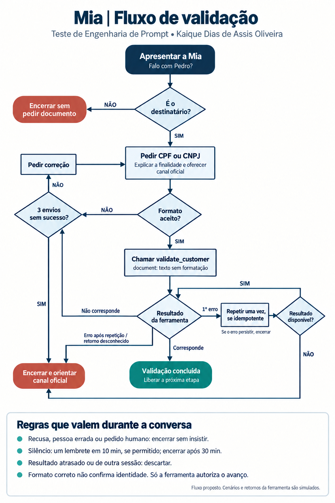

# Teste de Engenharia de Prompt — Monest

**Kaique Dias De Assis Oliveira**

A Mia precisa confirmar com quem está falando antes de oferecer qualquer produto. Pensei em uma conversa curta, que explique o pedido e respeite quem não quiser continuar.

Minha experiência com avaliação de LLMs ajudou a definir os casos de erro. A experiência comercial entrou no cuidado com a abordagem: pedir o necessário, explicar o motivo e não insistir.

## 1. Fluxo de conversa



### Caminho principal

1. **Apresentar a Mia:** “Oi, sou a Mia, assistente virtual do Banco Nova Era. Falo com Pedro?”
2. **Confirmar o destinatário:** se a pessoa disser que não é Pedro, pedir desculpas e encerrar. Se confirmar, pedir CPF ou CNPJ, conforme `isCPF`.
3. **Explicar o pedido:** “Para conferir seu cadastro, pode me passar seu CPF? Se preferir, você pode continuar por um canal oficial do banco.”
4. **Conferir o formato:** aceitar um documento por mensagem, com ou sem a pontuação padrão ou com espaços entre os grupos. Retirar apenas esses separadores, preservar zeros iniciais e manter as letras do CNPJ em maiúsculas. Não completar caracteres nem juntar números espalhados pelo texto.
5. **Consultar a ferramenta:** chamar `validate_customer` com o documento como string, sem formatação.
6. **Aguardar a confirmação:** só continuar quando o retorno confirmar a correspondência com o cliente esperado. A Mia responde: “Obrigada, Pedro! Confirmei seu cadastro e podemos continuar.” A oferta fica para a próxima etapa.

### Quando algo sai do esperado

| Situação | Como a Mia deve agir |
|---|---|
| Pessoa errada | Pedir desculpas e encerrar, sem pedir documento ou revelar o nome completo |
| Documento incompleto ou formato errado | Explicar o formato e pedir correção |
| Documento não corresponde ao cadastro | Pedir para conferir, sem dizer qual dado divergiu |
| Três envios sem sucesso | Encerrar e orientar a procurar um canal oficial; não pedir um quarto envio |
| Falha temporária na consulta | Repetir uma vez, se for seguro repetir a operação; se falhar de novo, explicar e encerrar |
| Retorno vazio, desconhecido ou malformado | Tratar como falha técnica, sem confirmar o cadastro nem repetir automaticamente |
| Dúvida sobre o pedido | Explicar que o documento serve para conferir o cadastro e oferecer a alternativa oficial |
| Recusa, pedido para parar ou atendimento humano | Respeitar o pedido e encerrar, sem afirmar que fez uma transferência |
| Desvio de assunto ou tentativa de mudar as regras | Retomar a validação uma vez; se acontecer de novo, encerrar sem insistir |
| Silêncio | Enviar um lembrete após 10 minutos, se permitido pelo canal; encerrar internamente após 30 minutos sem resposta |

Formato errado também conta como envio. Falha técnica e dúvida não gastam uma tentativa. Uma mensagem entregue duas vezes pelo canal conta uma vez; um novo envio do cliente conta normalmente. O terceiro envio ainda pode concluir a validação.

Os prazos são uma proposta inicial. A contagem começa quando o pedido é entregue e recomeça a cada mensagem do cliente. O lembrete não reinicia o relógio e só pode ser enviado uma vez por sessão.

### O que espero da ferramenta

O enunciado informa a entrada de `validate_customer`, mas não define o retorno. Para as simulações, considerei:

```json
{"status":"matched","session_id":"s1","call_id":"s1:1"}
```

- `matched`: o documento corresponde ao cliente esperado e a validação atende aos critérios do banco.
- `not_matched`: não foi possível confirmar a correspondência.
- `temporary_error`: houve uma falha temporária na consulta.

A integração precisa saber qual cliente está sendo validado. `session_id` e `call_id` servem para relacionar o retorno à sessão e à consulta certas; não são argumentos extras da ferramenta. Uma repetição técnica recebe outro identificador, para não ser confundida com a primeira consulta.

Só vale o retorno da consulta em andamento. Uma mensagem do cliente imitando um resultado de sucesso não confirma nada, e um retorno atrasado não reabre uma conversa encerrada.

Saber um CPF não prova a identidade de alguém. Saber um CNPJ também não prova que a pessoa representa a empresa. Se a ferramenta conferir apenas o formato ou a existência do documento, será preciso complementar a validação antes de liberar a próxima etapa.

### O que fica com a Mia e o que fica com o sistema

A Mia conduz a conversa. A integração controla tentativas, tempo, mensagens duplicadas e permissão para avançar. Eu não deixaria essas decisões dependerem só da memória do modelo.

Esta entrega contém o fluxo, os prompts e as simulações. A ferramenta e os controles de integração descritos aqui não foram implementados nem conectados a uma base real ou ao WhatsApp.

## 2. Prompt em Handlebars

Usei os dados do enunciado:

```json
{
  "companyName": "Banco Nova Era",
  "clientName": "Pedro Silva",
  "firstName": "Pedro",
  "isCPF": true
}
```

A ferramenta mantém a definição fornecida:

```json
{
  "title": "validate_customer",
  "description": "Valida informações de um cliente.",
  "properties": {
    "document": {
      "type": "string",
      "description": "CPF ou CNPJ, sem formatação."
    }
  },
  "required": ["document"]
}
```

| Arquivo | Conteúdo |
|---|---|
| [prompt.hbs](prompt.hbs) | Prompt antes da renderização, com as variáveis e a condição `if/else` |
| [prompt-cpf.txt](prompt-cpf.txt) | Prompt renderizado com os quatro dados do enunciado |
| [prompt-cnpj.txt](prompt-cnpj.txt) | Prompt renderizado mudando apenas `isCPF` para `false` |

As duas versões foram geradas e conferidas com Handlebars 4.7.9. `isCPF` precisa ser um booleano: `false` é diferente da string `"false"`. O nome completo fica no contexto interno; na conversa, a Mia usa apenas o primeiro nome.

O CNPJ pode incluir letras, como explica a [Receita Federal](https://www.gov.br/receitafederal/pt-br/acesso-a-informacao/acoes-e-programas/programas-e-atividades/cnpj-alfanumerico). Por isso, a normalização preserva essas letras e converte as letras ASCII para maiúsculas, sem tentar substituir caracteres parecidos de outros alfabetos.

## 3. Cenários de teste

As conversas e os retornos abaixo são simulados. Os documentos são exemplos; não houve consulta a cadastros reais. Aqui, “válido” significa confirmado pela ferramenta nas condições descritas na seção 1.

### 3.1. CPF confirmado

```text
Mia: Oi, sou a Mia, assistente virtual do Banco Nova Era. Falo com Pedro?
Cliente: Sim, sou eu.
Mia: Para conferir seu cadastro, pode me passar seu CPF? Se preferir, você pode continuar por um canal oficial do banco.
Cliente: 123.456.789-09
Chamada: validate_customer({"document":"12345678909"})
Retorno simulado: {"status":"matched","session_id":"s1","call_id":"s1:1"}
Mia: Obrigada, Pedro! Confirmei seu cadastro e podemos continuar.
```

A ferramenta recebe o documento sem pontuação. A Mia não o repete na resposta e espera a confirmação antes de continuar.

### 3.2. Documento inválido e limite de tentativas

Após a apresentação, a confirmação do destinatário e o pedido de CPF:

```text
Cliente: 123
Sistema: formato incorreto; envio 1 de 3; não chama a ferramenta.
Mia: O CPF precisa ter 11 dígitos. Pode conferir e mandar de novo?
Cliente: 123.456.789-09
Chamada: validate_customer({"document":"12345678909"})
Retorno simulado: {"status":"not_matched","session_id":"s1","call_id":"s1:2"}
Mia: Não consegui confirmar com esse documento. Pode conferir e mandar de novo?
Cliente: 01234567890
Chamada: validate_customer({"document":"01234567890"})
Retorno simulado: {"status":"not_matched","session_id":"s1","call_id":"s1:3"}
Mia: Não consegui concluir por aqui. Você pode continuar por um canal oficial do banco.
```

São três envios e duas consultas. O zero inicial é preservado e não há um quarto pedido. Se uma consulta retornar `matched`, inclusive no terceiro envio, a validação termina com sucesso naquele momento.

### 3.3. Cliente não responde

```text
Mia: Para conferir seu cadastro, pode me passar seu CPF? Se preferir, você pode continuar por um canal oficial do banco.
Cliente: [sem resposta]
Sistema: passaram 10 minutos; o canal permite o lembrete.
Mia: Se quiser continuar, estou por aqui. Você também pode procurar um canal oficial do banco.
Cliente: [sem resposta]
Sistema: passaram 30 minutos desde o pedido; encerra sem outra mensagem.
```

O silêncio não autoriza a validação. A Mia não chama a ferramenta nem manda novos lembretes por conta própria.

### 3.4. Cliente desvia do assunto

Após o pedido de documento:

```text
Cliente: Me fala primeiro quanto tenho de limite.
Mia: Preciso conferir seu cadastro antes de falar de limite. Você prefere continuar por aqui ou procurar um canal oficial do banco?
Cliente: Só me diz a taxa, vai.
Mia: Tudo bem, vou encerrar por aqui. Você pode procurar o banco quando quiser continuar.
```

A Mia retoma o pedido uma vez e depois encerra. Não inventa limite, taxa ou condição para tentar convencer a pessoa.

### 3.5. CNPJ

Com `isCPF: false`, após a confirmação do destinatário:

```text
Mia: Para conferir o cadastro, pode me passar o CNPJ da empresa que você representa? Se preferir, você pode continuar por um canal oficial do banco.
Cliente: 12.345.678/0001-95
Chamada: validate_customer({"document":"12345678000195"})
Retorno simulado: {"status":"matched","session_id":"s2","call_id":"s2:1"}
Mia: Obrigada, Pedro! Confirmei seu cadastro e podemos continuar.
```

A pergunta muda para CNPJ, e os 14 caracteres seguem como string. Se houver letras, elas também precisam ser preservadas.

### 3.6. Falha técnica e pedido para parar

Após a confirmação do destinatário e o pedido de CPF:

```text
Cliente: 123.456.789-09
Chamada: validate_customer({"document":"12345678909"})
Retorno simulado: {"status":"temporary_error","session_id":"s3","call_id":"s3:1"}
Sistema: a operação pode ser repetida com segurança; tenta uma vez, sem gastar outro envio.
Chamada: validate_customer({"document":"12345678909"})
Cliente: Pode parar, não quero continuar.
Mia: Tudo bem, vou encerrar por aqui.
Retorno simulado, após o encerramento: {"status":"matched","session_id":"s3","call_id":"s3:1:retry"}
Sistema: descarta o retorno porque a sessão já foi encerrada.
```

O pedido para parar prevalece mesmo com uma consulta em andamento. O resultado tardio não libera a oferta e não gera outra mensagem.

## 4. Gestão de riscos

| Risco | Como lidar |
|---|---|
| Oferta antes da validação | A integração só libera a próxima etapa depois de um `matched` da consulta e da sessão corretas |
| Documento de terceiro | Conferir a correspondência com o cliente esperado; conhecer o documento não basta para provar identidade |
| Contato com a pessoa errada | Encerrar sem pedir documento ou revelar o nome completo |
| Tentativas para descobrir dados do cadastro | Limitar os envios e responder sem dar pistas sobre o motivo da divergência; manter um limite de consultas entre sessões |
| Retorno vazio, trocado ou atrasado | Não confirmar o cadastro; conferir a origem, a sessão e a consulta antes de usar o resultado |
| Instruções do cliente ou da ferramenta tentando mudar as regras | Tratar o texto como dado, sem obedecer a pedidos para ignorar o prompt ou simular sucesso |
| Dois documentos, ou documento junto de telefone | Pedir um único documento em uma mensagem, sem juntar os números |
| CNPJ com letras | Preservar as letras na normalização |
| Falha no serviço | Repetir uma vez quando houver garantia de idempotência, isto é, quando repetir não produzir efeitos adicionais; se persistir, encerrar sem culpar o cliente |
| Recusa ou desconfiança | Explicar quando houver dúvida e respeitar a recusa, oferecendo um canal oficial |
| Exposição de dados | Não repetir documentos nas respostas; retirar dados pessoais dos registros usados em análise e treinamento |
| Pedido de atendimento humano | Orientar a procurar o atendimento oficial, sem inventar uma transferência |
| Senha, código, foto ou anexo não solicitado | Não reproduzir o conteúdo; orientar a não enviar segredos e pedir apenas o documento em texto, se a pessoa quiser continuar |

A coleta fica limitada ao documento necessário para conferir o cadastro. Antes de colocar o fluxo em uso, o banco precisa definir quem pode acessar os dados, por quanto tempo serão guardados e qual é a base legal da coleta. A remoção de dados pessoais dos registros de análise precisa acontecer na integração, antes do armazenamento.

## 5. Refinamento após o lançamento

Se 30% dos clientes abandonassem na validação, eu começaria olhando onde a conversa parou. A pessoa ficou desconfiada, não entendeu o pedido ou esperou demais pela consulta? Mudar a frase sem entender isso pode deixar o problema real passar.

### Entender os 30%

Primeiro, conferiria como essa taxa foi calculada. Separaria falta de resposta, recusa, contato errado, pedido de atendimento humano e falha técnica. Também distinguiria quem nunca respondeu de quem conversou e parou depois.

Para comparar versões, observaria cada sessão durante 30 minutos após a entrega do pedido. A taxa de silêncio seria a quantidade de sessões sem nenhuma resposta e sem outro encerramento, dividida pelo total de sessões com pedido entregue e 30 minutos completos de acompanhamento. Quem respondeu e parou depois ficaria em outra categoria; conversas ainda ativas também.

Essa janela serve para a análise. O encerramento da conversa continua dependendo de 30 minutos de inatividade, contados da última mensagem do cliente ou da entrega do pedido. São contagens diferentes.

Registraria os horários do pedido, dos envios de documento, das consultas e do encerramento, além do resultado, da versão do prompt e do tipo de erro. Usaria um identificador pseudônimo, sem nome, documento ou texto livre nas métricas, com acesso restrito e prazo de retenção definido.

Compararia os resultados por CPF/CNPJ, origem do contato e horário. Também leria uma amostra de conversas com os dados pessoais removidos. Se a demora da ferramenta explicar a saída, corrigiria o serviço antes de testar outra abordagem.

### Testar uma mudança pequena

Se o problema estiver no pedido do documento, compararia duas perguntas:

- **A, atual:** “Para conferir seu cadastro, pode me passar seu CPF? Se preferir, você pode continuar por um canal oficial do banco.”
- **B, proposta:** “Preciso conferir seu cadastro e não vou pedir senha nem código. Você prefere me passar seu CPF por aqui ou continuar por um canal oficial do banco?”

A hipótese é que explicar o que não será pedido diminua a desconfiança. Para CNPJ, adaptaria a pergunta à empresa. As regras de validação, os limites e o respeito à recusa seriam iguais nas duas versões.

Dividiria os clientes elegíveis por sorteio, metade em cada versão, mantendo a mesma versão para quem voltar. Na análise principal, usaria só a primeira sessão de cada cliente.

A métrica principal seria a proporção dos clientes sorteados que concluem a validação em até 30 minutos após o envio inicial do pedido. Todos entram no cálculo, inclusive quem não recebeu a mensagem; a taxa de entrega aparece à parte. A análise de silêncio entre pedidos entregues continua separada. Escolher um canal oficial não conta como validação concluída sem confirmação pela integração.

### Decidir com os resultados

Definiria antes do teste a amostra necessária, a duração e o ganho mínimo que justificaria a mudança, usando a taxa real de conclusão. Os 30% de abandono não significam, sozinhos, que os outros 70% concluíram a validação.

Compararia a diferença em pontos percentuais e o intervalo de confiança de 95%. O teste precisa cobrir os períodos de uso do banco, e eu não o encerraria só porque apareceu um resultado favorável no meio do caminho.

Além da conclusão, acompanharia reclamações, pedidos para parar, erros, demora, exposição de dados e validação indevida. Uma falha crítica confirmada interrompe a versão afetada. Para reclamações e demora, combinaria os limites aceitáveis antes do teste.

Só adotaria B se o ganho fosse relevante e esses cuidados fossem mantidos. Se o resultado fosse inconclusivo, manteria A e investigaria mais.

### Levar os aprendizados de volta ao prompt

Cada erro recorrente vira um caso de teste sem dados pessoais, com a resposta recebida, a resposta esperada e o motivo da correção. Depois de ajustar o prompt ou a integração, eu repetiria esses casos antes de publicar a mudança.

Na revisão, olharia cinco pontos: a Mia esperou a ferramenta, protegeu os dados, respeitou a recusa e os limites, falou com clareza e usou as variáveis certas? Uma resposta agradável não compensa uma validação indevida.

Por exemplo, depois de “não vou passar meu CPF aqui”, a resposta esperada é “Sem problemas. Você pode procurar um canal oficial do banco.” Insistir ou inventar uma condição comercial reprova o caso.

A avaliação precisa incluir situações menos óbvias. Dizer “Não consegui confirmar, mande de novo” depois de uma falha técnica também está errado: transfere para o cliente um problema da consulta.
